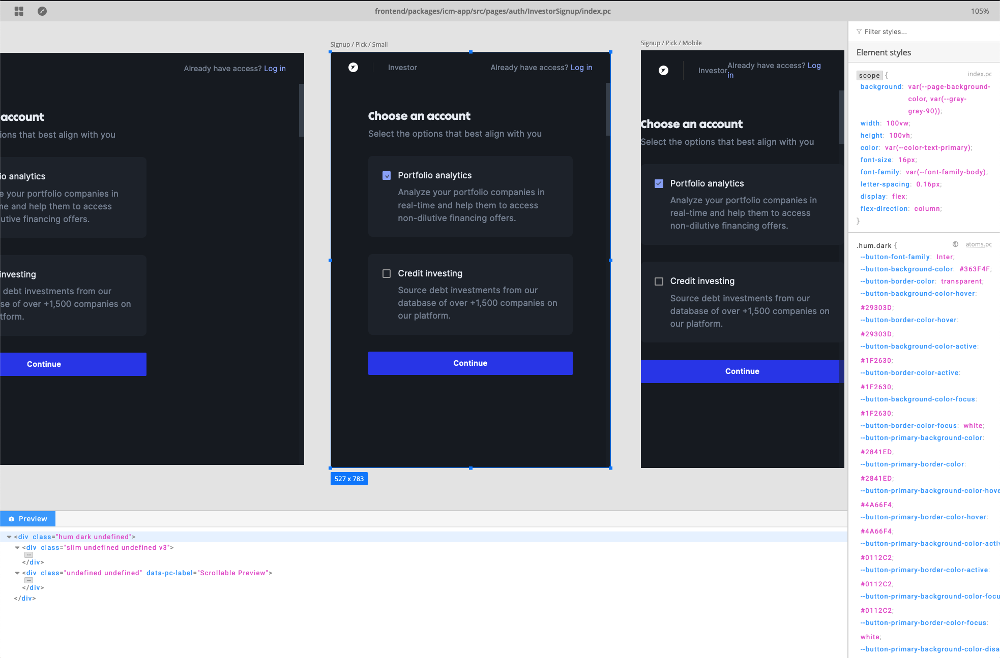
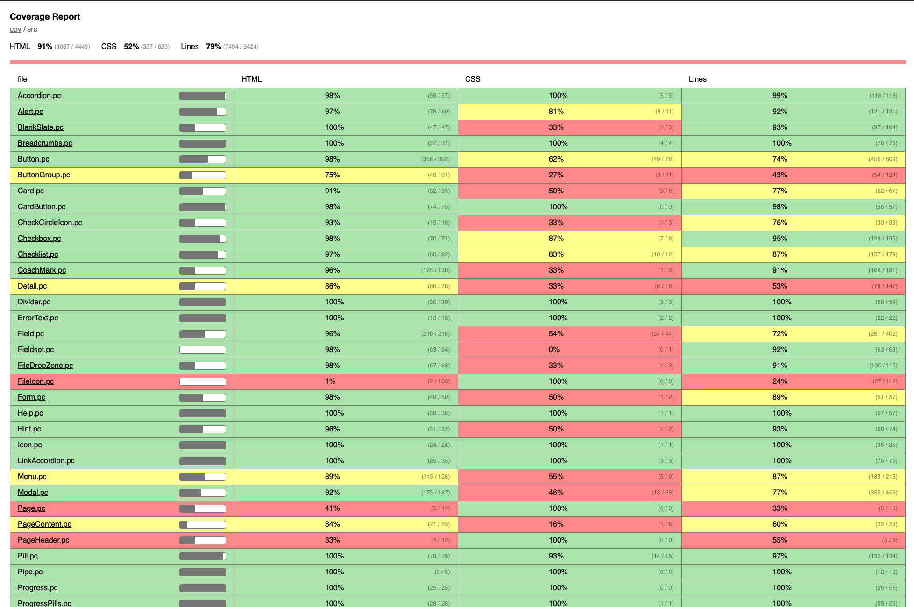
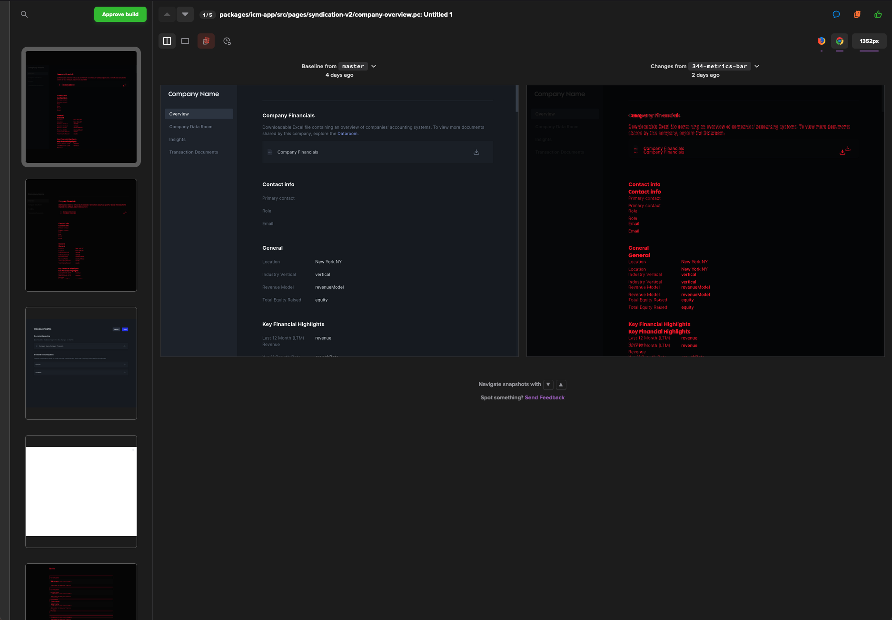

<br />

<div style="text-align: left; margin-bottom: 32px;">
  
</div>

<br />


Paperclip is a tiny DSL for HTML & CSS that aims to bring scoped styles & a richer UI development experience to any web language.


Paperclip can be used on its own to build static websites, or be used to expose primitive components that you can integrate into your codebase. It's designed for any language to use, and currently works with React out of the box.

## Installation

Just run this command in your existing project to get started

```
npx @paperclip-ui/cli init
```

This will walk you through a brief setup process. Next, just run:

```
npx @paperclip-ui/cli build
```

## Resources

- Community
  - [Discord](https://chat.paperclip.dev)
- API
  - [Syntax](https://paperclip.dev/docs/usage-syntax) - How to write Paperclip documents
  - [React usage](https://paperclip.dev/docs/usage-react) - Using Paperclip UIs in your React code
  - [Configuration](https://paperclip.dev/docs/configure-paperclip) - How to configure Paperclip for your codebase
- Examples
  - [Syntax / basic](./examples/syntax-basic)
  - [React / basic](./examples/react-basic)
  - [Tailwind](./examples/React-basic)
- Tools
  - [CLI usage](https://paperclip.dev/docs/usage-cli)
  - [Designer](https://paperclip.dev/docs/visual-tooling)
  - [Visual regression tools](https://paperclip.dev/docs/visual-regression-tooling)
  - [VS Code extension](https://paperclip.dev/docs/guide-vscode)
- Integrations
  - [Webpack](https://paperclip.dev/docs/getting-started-webpack) - Setting up with Webpack
  - [Percy](https://paperclip.dev/docs/configure-percy)
  - [Jest](https://paperclip.dev/docs/configure-jest)
  - [Prettier](https://paperclip.dev/docs/configure-prettier)
- Guides
  - [Creating a compiler](https://paperclip.dev/docs/guide-compilers/)
  - [Using third-party CSS](https://paperclip.dev/docs/guide-third-party-libraries)


## Goals

- To have strict control over how elements are styled, while maintaining the flexibility of CSS. 
- To be generic, and compatible with just about any language, strongly or dynamically typed. 
- To compile to plain code, and not require any runtime. 
- To make UI development feel more like drawing. Developers shouldn't have to wait around for their UI code to compile, and should have more visual tooling to help <i>visually</i> develop their UIs.
- To eventually have enough UI tooling that would enable non-engineers to create UIs in tandem with developers.


## Example

Here's a kitchen sink example of what a Paperclip UI looks like:


```html

<!-- Imported CSS can be contained to a namespace that you can use throughout the document to have complete control
 over what's styled -->
<import src="css-modules/tailwind.css" as="tw" />

<!-- These styles are scoped just to this document -->
<style>
  * {
    box-sizing: border-box;
  }
</style>

<!--  
  You can define re-usable blocks of HTML that can be imported into your application code.
  Also, notice how Tailwind is being applied just to this element.
-->
<div export component as="Message" class="$tw py-8 bg-blue-100">

  <!-- Styles that are nested are scoped to the parent element. -->
  <style>

    /* You can set declarations directly in style blocks. This
    will be applied to the parent element. */
    color: magenta;

    /* You can define style rules for descendents of the parent element. */
    span {
      color: orange;
    }
  </style>

  <!-- This is a "slot" that allows custom children to be inserted into primitive components. -->
  {children}

  <span>
      I'm orange!
  </span>
</div>
```

Paperclip UIs compile directly to code that you can import into your app:

```jsx
import React from "react";
import ReactDOM from "react-dom";
import { Message } from "./my-module.pc";

// this will render "Hello Paperclip! I'm orange!"
ReactDOM.render(<Message>
  Hello Paperclip!
</Message>, document.body);
```

Currently, UIs compile to **React** and **static HTML**. More languages are planned for after Beta. 


<!-- ## Features

- Scoped CSS by default, and expressive syntax that enables you to be more precise about what elements are styled. This can even be used to scope CSS frameworks.
- Generic, and designed for any language. You can use Paperclip in your existing codebase.
- Compiles to plain performant code. No runtime.
- Visual test tooling to help you track UI changes across your app.
- Code coverage tooling to help you figure out how much HTML & CSS is coverage under visual tests.
- Realtime visual development, directly within VS Code.  -->

This is the designer that you can use to build UIs in realtime:



Here's an example of a code coverage report that shows how much HTML and CSS is coverage for visual testing:



Here's an example of visual tests that are performed using Percy. Paperclip also has a tool for this that you can use locally. 




<!-- ### Non-goals

- Logic. This is already a very well solved problem. Paperclip only covers what's necessary to integrate with an existing codebase.
- Pre-processors. Though this may be possible in the long term, Paperclip won't have pre-processors that would enable you to  -->

<!-- 

## Sponsors


 -->
