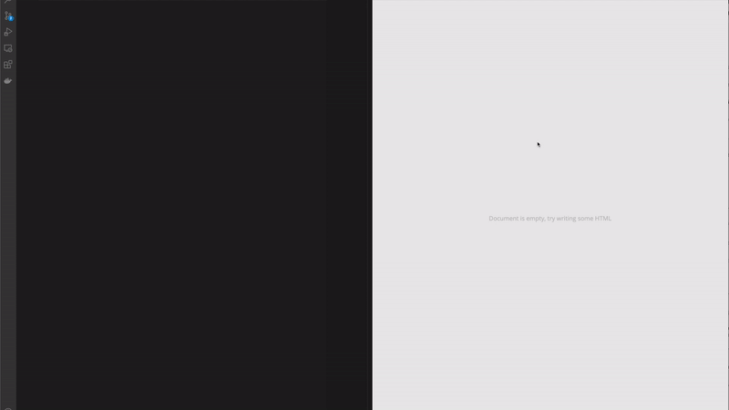

<br />

<div style="text-align: left; margin-bottom: 32px;">
  
</div>

<br />

Paperclip is a DSL for UI builders. Here's what a basic UI file looks like:

```html
<!--
  @frame { height: 768, visible: false, width: 1024, x: -176, y: 173 }
-->
<ul component as="List">
  <style>
    padding: 14px;
    margin: 0px;
    font-family: sans-serif;
    display: flex;
    flex-direction: column;
    gap: 8px;
    list-style-type: none;
  </style>
  {children}
</ul>

<!--
  @frame { height: 768, visible: false, width: 1024, x: -1, y: 0 }
-->
<li component as="ListItem">
  {children}
</li>

<!--
  @frame { height: 366, title: "Todos", width: 258, x: 766, y: 402 }
-->
<List>
  <ListItem>buy cereal</ListItem>
  <ListItem>buy milk</ListItem>
</List>
```

Here's a demo of a UI builder prototype that works with Paperclip:



Paperclip UIs cover just **HTML, CSS, and primitive components**. Developers can import these primitive components into their codebase like so:

```jsx
import * as styles from "./styles.pc";

export const List = ({items}) => {
  return <styles.List>
    {items.map(item) => {
      return <styles.ListItem key={item.id}>{item.label}</styles.ListItem>;
    }}
  </styles.List>;
};
```

### Language features

Paperclip is limited to bare minimum features that are necessary for building presentational components. This includes:

- Primitive components
- Styles and variants
- Slots (being able to insert children in certain areas of a component)
- Attribute bindings

### Tooling features

- Designed to compile down to just about any language. Currently targets React & static HTML.
- Can compile to strongly-typed code.
- Comes with visual regression & code coverage tooling (for tracking how much of the UI is covered for visual regressions).

### UI Builder features

Paperclip aims to provide an easy-to-use API for UI builders:

- APIs for editing source code.
- Rust-based engine for smooth editing.
- multi-player editing capabilities (CRDT based).

Here's a basic example of the editing API (still very much WIP):


```typescript
import { WorkspaceClient } from "@tandem-ui/workspace-client";
import { FramesRenderer } from "@paperclip-ui/web-renderer";

const client = new WorkspaceClient();
const project = await = client.openProject({
  uri: "file:///path/to/project/directory"
});

const doc = await project.getDocuments().open("file:///path/to/project/directory/src/components/button.pc");

// render the document
const mount = document.createElement("div");
let frames = renderFrames(doc.getContent());
document.body.appendChild(mount);

// When the document changes, re-render
doc.onAppliedChanges((newData) => {
  frames = patchFrames(frames, newData);
});

// Make a change to the 
doc.editVirtualObjects({
  kind: VirtualObjectEditKind.AppendChild,

  // path to element to append the child to
  nodePath: "0",

  // Child HTML
  child: {
    value: `Hello World`,
  },
});
```

### Goal

The goal for Paperclip is to be a _scalable_ data format for UI builders, and safe enough for non-engineers to feel confident about making visual changes. 


In a perfect world, Paperclip could be the engine for a UI builder that enables: 

- Designers to have complete control over HTML and CSS development with [Webflow](https://webflow.com)-like tooling.
- PMs and anyone else to create variant UIs / text / styles for a/b testing. 
- Enable anyone on a team to spot-edit visual bugs that are in production (wouldn't it be great to right-click any staging / production element and edit it on the spot??). 


 My sense about the general direction of _many_ UI builders is that they're mostly adopting the same principles (primitive components, slots, variants), and could benefit from using an open-source data model that's geared more for developers. Hopefully in the future, developers of UI builders can add their own rendering engine, create supersets, and rules on top of Paperclip according to the features that their UI builder supports.

### Why focus on the data model?

Mostly because the data model is easier to shape than a UI builder based on real-world feedback around how it's used in a production environment. As a developer, I care mostly about how a tool influences the direction of a codebase. If I believe that a tool is detrimental to the overall health of the codebase, then there's no point in using it.

And, for me it's a hard sell to allow _anyone_ to write code who isn't a developer. That's why the data model is such a focus in ensuring that anyone working with it (written by hand or in a UI builder) has enough guardrails (removing incidental complexity, and providing safety tooling) to create shippable UIs.

### Why code as a data model?

Mostly for maintainability, collaboration, and safety.

- A readable UI file can be easily reviewed for any structural problems.
- A readable UI file makes merge conflicts easy to resolve.
- Sometimes it's easier to write functionality by hand.
- Easier escape hatch for engineers that are worried about locked into a UI builder (esp. for engineers looking to collaborate).
- Easier to reason about when wiring up with logic. 

### Why not use an existing language?

Mostly to have total control over the data model, and to only have features specifically for visual development. Most languages contain features that make it difficult to effectively map to a _practical_ UI builder (even vanilla HTML and CSS to an extent). I think for a UI builder to be flexible and simple, that simplicity needs to be reflected in the data model. 

Another reason why Paperclip was created is to ensure that _multiple_ languages could be targeted. Eventually the plan is for Paperclip to compile down to just about any language.

### What's the status of this Project?

Paperclip has been in active development for a few years, and most of the basic functionality is in. However, It's at an inflection point where a UI builder is necessary to help shape the DSL.

### Can I use Paperclip now?

Yes! Paperclip is stable and  has been in active development for a few years now, and can be used to build React applications. Currently it's powering most of the HTML and CSS at [Hum Capital](https://humcapital.com/).

## Installation

Just run this command in your existing project to get started

```
npx @paperclip-ui/cli init
```

This will walk you through a brief setup process. Next, just run:

```
npx @paperclip-ui/cli build
```

## Resources

- Community
  - [Discord](https://chat.paperclip.dev)
- API
  - [Syntax](https://paperclip.dev/docs/usage-syntax) - How to write Paperclip documents
  - [React usage](https://paperclip.dev/docs/usage-react) - Using Paperclip UIs in your React code
  - [Configuration](https://paperclip.dev/docs/configure-paperclip) - How to configure Paperclip for your codebase
- Examples
  - [Syntax / basic](./examples/syntax-basic)
  - [React / basic](./examples/react-basic)
  - [Tailwind](./examples/React-basic)
- Tools
  - [CLI usage](https://paperclip.dev/docs/usage-cli)
  - [Designer](https://paperclip.dev/docs/visual-tooling)
  - [Visual regression tools](https://paperclip.dev/docs/visual-regression-tooling)
  - [VS Code extension](https://paperclip.dev/docs/guide-vscode)
- Integrations
  - [Webpack](https://paperclip.dev/docs/getting-started-webpack) - Setting up with Webpack
  - [Percy](https://paperclip.dev/docs/configure-percy)
  - [Jest](https://paperclip.dev/docs/configure-jest)
  - [Prettier](https://paperclip.dev/docs/configure-prettier)
- Guides
  - [Creating a compiler](https://paperclip.dev/docs/guide-compilers/)
  - [Using third-party CSS](https://paperclip.dev/docs/guide-third-party-libraries)


## Contributing

Most of the focus right now for Paperclip is around the UI builder, so if you would like to help out, feel free to reach out! Some other areas in the future will include:

- More compilers: Java, Ruby, Python, PHP.
- Migration tooling to help people translate their existing HTML & CSS into Paperclip UIs
- Get VS Code extension to work with github.dev, making it easier for people to edit UI files online.
- Help with language featuers that are mappable to UI tooling.
- Performance adjustments around Rust rendering engine.
- More tooling that enables Paperclip to be edited or visualized in other mediums (not just UI builders).
  - e.g: ability to edit any UI directly in staging
- More _safety_ features that give non-engineers confidence about shipping UIs.
  - visual regression coverage
  - More robust inferencing engine
- More functionality to the rendering engine
  - Ability to change type of rendering (e.g: React Native)
  - Ability to inject custom web components
  - CSS Houdini support 
- Help on shaping the DSL for more visual development capabilities