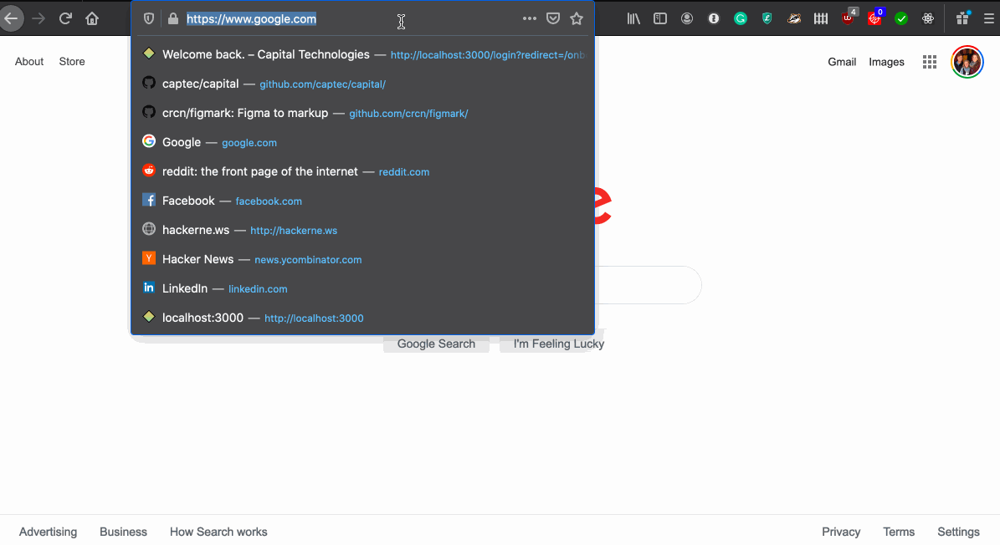
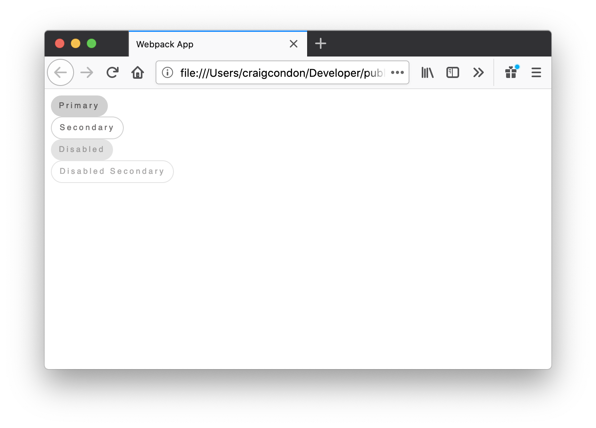

figma-paperclip allows you to import Figma designs in React code.

### Resources

- [Getting Started](#getting-started)
- [Examples](./examples)

## Getting started

To get started, you'll need to install the CLI tool - go ahead and run:

```
npm install figmark -g
```

`cd` to your project directory, then run:

```
figmark init
```

This will prompt you for a few things, starting with your **Figma personal access key**. Here's how you generate one:



Next you'll need to set your **team ID**. Herre's how you find that (it's in the URL):


_Finally_ you can download your Figma designs:

```
figmark pull
```

> ☝🏻Run this command whenever you want to update your designs locally.

> You'll also notice `*.pc` files which React files are compiled from. To learn more about how to use PC files, you can check out the [Paperclip](https://github.com/paperclipui/paperclip) repository.

That's it! At this point you should have generated React files that you can import.

<!-- ### Do's & Don'ts

- 🔴 Don't store your generated designs in GIT. Treat them like dependencies.
- 🟢 Specify file versions that you'd like to download in the `fileVersions` config property.
- 🔴
-->

### React example

Here's a quick demo of how designs are used in code. Starting off with a few button variations:


After pulling these designs using `figmark pull`, we can import them like so:

```tsx
/*
  These are the designs imported from Figma. Each layer is exported as 
  an individual component that corresponds with the layer name. This 
  "slicing up" allows us to add responsive CSS styles to each individual layer.
*/

import {
  // This is the main button
  ButtonPrimary,

  // This is a child of ButtonPrimary -- we know that
  // because ButtonPrimary_ is the prefix.
  ButtonPrimary_Label3,

  // Another child of ButtonPrimary
  ButtonPrimary_Background3,

  // All classnames that correspond with each layer
  classNames,
} from "./design-generated/test/figmark-2";

import * as React from "react";
import * as cx from "classnames";
import styled from "styled-components";

// We can easily add responsiveness to our designs like so
const ResponsiveButton = styled(ButtonPrimary)`
  cursor: pointer;
  display: block;
  display: flex;
  .${classNames.buttonPrimary_background3} {
    padding: 8px 10px;
  }
  .${classNames.buttonPrimary_label3} {
    font-family: Helvetica;
  }
`;

type EnhancedButtonProps = {
  disabled?: boolean;
  primary?: boolean;
  secondary?: boolean;
  children?: React.ReactNode;
};

const EnhancedButton = ({
  disabled,
  secondary,
  children,
}: EnhancedButtonProps) => (
  <ResponsiveButton
    className={cx({
      [classNames.buttonDisabled]: disabled,
      [classNames.buttonSecondary]: secondary,
    })}
  >
    <ButtonPrimary_Background3>
      <ButtonPrimary_Label3>{children}</ButtonPrimary_Label3>
    </ButtonPrimary_Background3>
  </ResponsiveButton>
);

export const ButtonsPreview = () => {
  return (
    <>
      <EnhancedButton>Primary</EnhancedButton>
      <EnhancedButton secondary>Secondary</EnhancedButton>
      <EnhancedButton disabled>Disabled</EnhancedButton>
      <EnhancedButton disabled secondary>
        Disabled Secondary
      </EnhancedButton>
    </>
  );
};
```

Here's what the code above looks like when loaded in a browser:



> For documentation on how to use these designs in Webpack, check out the [Paperclip](https://github.com/paperclipui/paperclip) repository.

That's all there is to it! 🙌

#### Recommendations & Notes

- You should GIT-ignore generated design files -- treat them like dependencies.
- Unused layers are dropped from your application bundle if you're using tree-shaking.
- `*.pc` file documentation can be found in the [Paperclip repository](https://github.com/paperclipui/paperclip)
- You can preview `*.pc` files directly using the [VS Code extension](https://marketplace.visualstudio.com/items?itemName=crcn.@paperclipui/vscode-extension)
