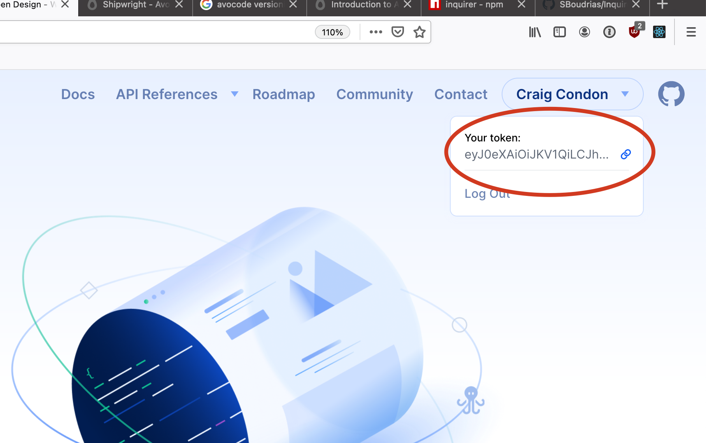

CLI tool for synchronizing design files to Paperclip via [Open Design](https://opendesign.dev). 


## Getting started

First run this in your **project directory**: 

`yarn add paperclip-open-design --dev`

After installing, go ahead and run this:

```
yarn paperclip-open-design init
```

This will prompt you to enter your Open Design token which can be found on the https://opendesign.dev home page here:




After initializing, just run:

```
yarn paperclip-open-design pull
```


## Usage

`paperclip-open-design` pulls basic information about your layers & styles that you can reference within Paperclip files. For example:

```html
<import src="@company/design" as="design" />

<div as="Button" export component>
  <style>
    @include design.button;
    &:hover {
      @include design.button_hover;
    }
  </style>
</div>
```

👆 from here, you can import your components directly into your app code. 

To find the mixin you're looking for, you can open up the auto-generated `preview.pc` in your open design directory:

[PREVIEW]

while holding `command`, select an element within the preview to jump to the source code. That will reveal all of the mixins that you can use.

#### Organization

Design files can be thought of as _dependencies_ for the front-end. So what I like to do is create a wrapper module that controls open design syncing (something like `@company/designs`) -- from there you can import that module into your package. Check out `examples/wrapper-module` on how to do this.