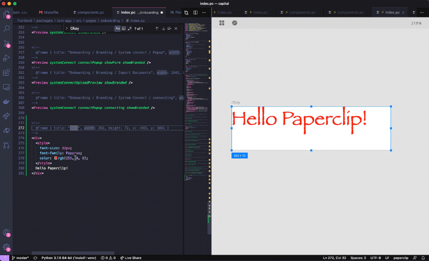
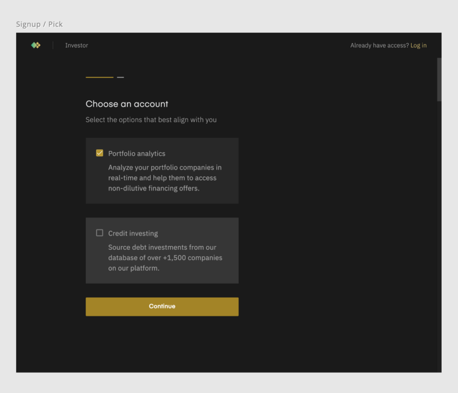
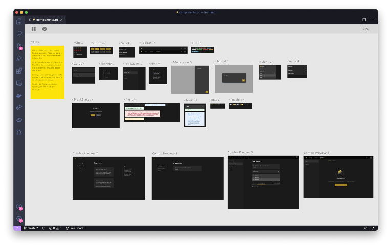
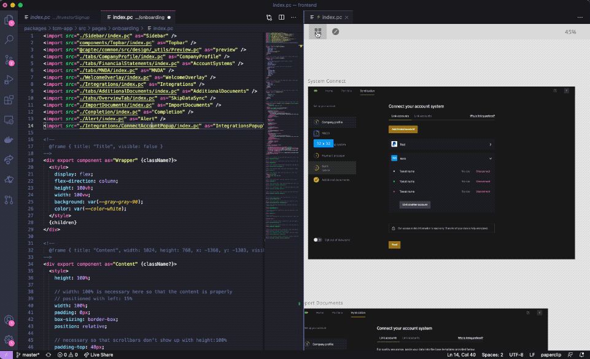
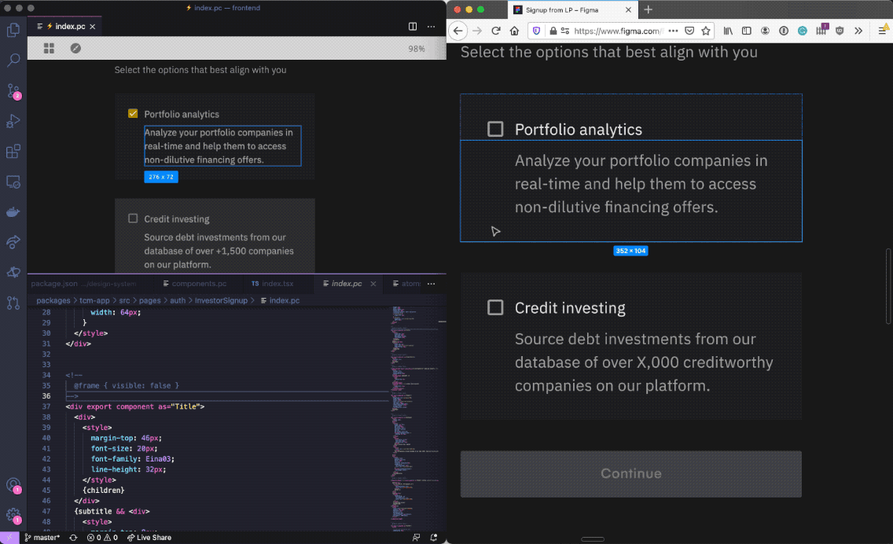
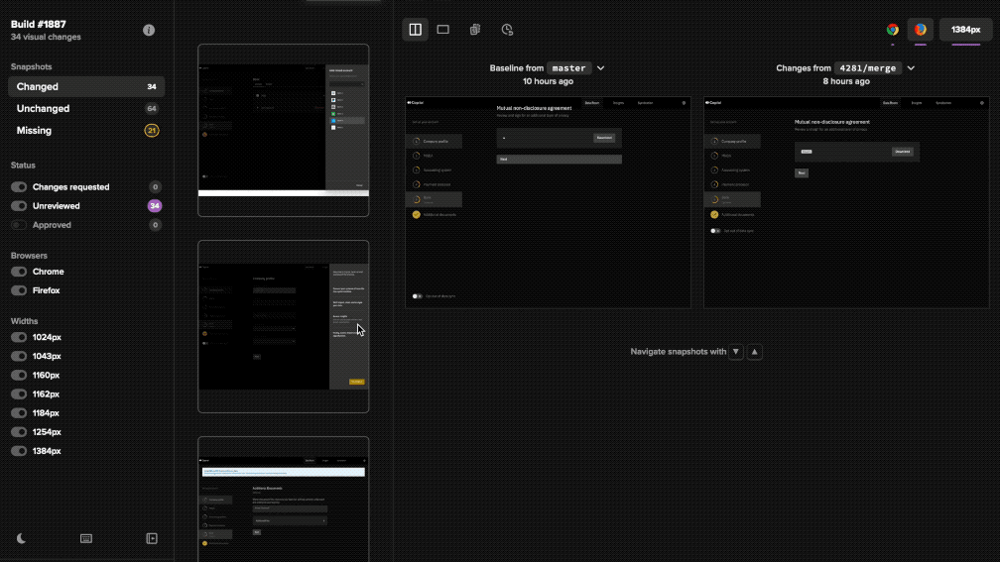

I’ve been building front-end applications for a while now, and one of my biggest gripes is just how slow and un-fun it is. If anyone were to ask me what the biggest time sink in web development is, I’d say that it’s writing HTML and CSS. That’s not what I want to spend my time on!

<!--truncate-->


HTML & CSS development is mostly visual, yet, developers write it by hand, then have to wait a few seconds to see their UI appear in the browser. That’s not so bad for small projects, but larger projects that take 3+ seconds to reload can be excruciating to work with. Not only that, but this bottleneck can also affect the quality of the app.

I’ve worked with many designers and developers over the years, and the consistent pattern I’ve seen with every team is that developers would often-times either cut design corners in order to ship features on time, or give large estimates so that they could spend 90% of their time making sure that the UI is perfect. To pile on to that, I’ve found that developers typically wouldn’t translate designs correctly, and UIs would be just a little off. Since designers can’t really make changes themselves, they usually ask their developer to fix the problem who then points them to “file a bug in GitHub” in the endless sea of tickets, never to be seen again. This is a problem that I wanted to fix.

I starting focusing on UI builders four years ago, there should be a better tool for creating web UIs that has an experience similar to Figma or Sketch. Three years later and after many failed ideas, I finally feel like I built something that’s practical enough to use.

## A hybrid tool between design & code

Paperclip is a free and open source DSL for presentational components that brings web development closer to a designer-like experience, all within your existing IDE. Here’s the look and feel of it:


You never have to leave your editor to create UIs, or wait around for changes to appear. Previews update instantly as you’re making changes, even for very large projects.



> If you’re not using one of the supported IDEs, you can run the command line tool instead to launch the standalone preview app. From there you can use any text editor you want.

Paperclip just covers your application’s appearance, and the tooling is designed to help you build your UI out as quickly as possible. The syntax is simple, and just covers HTML, CSS, and primitive components. Here’s an example:

```html
<style>
  div {
    color: red;
  }
</style>

<!--
  Frames are kind of like artboards, and allow you to do responsive testing.  
  @frame { title: "Desktop", width: 1024, height: 768 }
-->

<div export component as="Message">
  Hello {name}!
</div>
```

It’s pure UI development focus without logic and other stuff getting in the way. After you’ve defined your Paperclip UIs, you can import them into into your app.

## How to use Paperclip in your app
> Paperclip is designed to support many different languages and frameworks. For the Beta however, it only supports React, and TypeScript apps.

Paperclip UIs compile to plain code by either using the command line tool, or by using the Webpack loader for a cleaner integration. From there you can just import a UI file like a normal module:

```javascript
import * as styles from "./styles.pc";

function MyApp() {
  return <styles.Message name="Bob" />;
}
```

If you’re familiar with Styled Components and other CSS-in-JS libraries, you’ll find that the API is similar. Just like CSS-in-JS libraries, styles are isolated to the components they’re assigned to, so you don’t have to worry about CSS leaking out to the rest of your app.

Here’s a more complete example of a design file:

```html
<import src="@captec/design-system/src/components.pc" as="ds" />

<!--
 ... more code above ...
-->

<!--
  @frame { visible: false }
-->
<div export component as="Title">
  <div>
    <style>
      margin-top: 46px;
      font-size: 20px;
      font-family: Eina03;
      line-height: 32px;
    </style>
    {children}
  </div>
  <div>
    <style>
      margin-top: 8px;
      color: var(--color-text-subdued);
      margin-bottom: 32px;
    </style>
    {subtitle}
  </div>
</div>

<!--
  @frame { visible: false }
-->
<div export component as="ProgressPills">
  <style>
    display: flex;
  </style>
  {children}
</div>

<!--
  @frame { visible: false }
-->
<ds.Card export component as="AccountTypeOption" interactive {onClick}>
  <ds.Checkbox {checked?} />
  <ds.Detail title={name} {description} />
</ds.Card>

<!--
 ... more code below ...
-->
```

> This is a snippet taken from production code, and isn’t as clean as it could be since there are some CSS properties that should be derived from design tokens (such as margin-top: 46px, font-family: Eina03). However, this isn’t that big of a problem with Paperclip since this file is covered for visual regressions (more on that later). We can confidently refactor this later without changing what the UI looks like.

Here’s some of the React code associated with this design file above:

```javascript
import * as styles from "./styles.pc";

const InvestorSignupPage = () => {
  const {
    title,
    accountKinds,
    onAccountKindChange,
    onContinue,
    onSignup,
  } = useSignupPage();

  return (
    <styles.Wrapper>
      <styles.Header
        title={title}
        accessLink={<NavLink to="/login">Log in</NavLink>}
      />
      <styles.Content>
        <styles.Title subtitle="Select the option that best aligns with you">
	  Choose an account
	</styles.Title>
        <styles.AccountTypeOption
	  checked={accountKinds.includes(AccountKind.PortfolioAnalytics)}
	  name="Portfolio analytics"
	  description="Analyze your portfolio companies in real-time and help them to access non-dilutive financing offers."
	  onClick={() => onAccountKindChange(AccountKind.PortfolioAnalytics)}
	/>
	<styles.AccountTypeOption
	  checked={accountKinds.includes(AccountKind.CreditInvesting)}
	  name="Credit investing"
	  description="Source debt investments from our database of over +1,500 companies on our platform."
	  onClick={() => onAccountKindChange(AccountKind.CreditInvesting)}
	/>
	<Button wfull v3 primary onClick={onContinue}>
          Continue
	</Button>
      </styles.Content>
    </styles.Wrapper>
  );
};
```



> With Paperclip, you can create just about any web UI you want with few restrictions. You can also use as much or as little of it as you want.

## Perfect for your design system

Paperclip is a great tool for your design system since it gives you a fast and free-form environment for creating building blocks that you can re-use throughout your application. Here’s an example of a design system that I’m currently working on at the time of writing this article:



You can build your design system out quickly since every style change appears instantly across your entire app. For finicky things such as layout, this is a very useful feature to have.

If you prefer to keep your UIs organized in separate files, you can do that and your UIs will be just as searchable by developers looking for a particular component.



Paperclip is not only a great tool for your design system because it’s a fast environment, there’s also a great amount of safety that Paperclip offers to help you build scalable and maintainable UIs that are resilient to visual production bugs and software rot.

## Explicit CSS

One of the problems I find with CSS is the global nature of it. It can be manageable for small projects, but can quickly become unwieldy when your app and team gets larger. Typically what happens I’ve found is that with global CSS, it becomes unknown about what parts of the app styles are applied to. As a result of that, engineers can feel comfortable about making CSS changes and decide that the safest route is to leave it alone (or risk shipping a bug to production). Over the course of years as CSS piles up, it’s easy for the whole styling system to become a giant Rube Goldberg machine. That tech debt never usually goes away, developers just deal with it.

Today, developers have systems in place such as CSS Modules, CSS-in-JS, SMACSS, and such to help manage some of the issues around CSS. However, most of the tooling still allows developers to easily write global CSS in some way (like nested style selectors which has caused visual bugs in my experience). In Paperclip, that risk is greatly diminished.

In Paperclip, CSS is scoped in the document it’s defined in. Here’s an example:

```html
<!-- 
  You can define styles at the top of the document, and they will
  be applied to all elements within this file.
-->
<style>
  div {
    color: red;
  }
</style>

<div>
  I'm red!

  <span>
    
    <!-- 
      You can also define styles within an element, 
      and they will only be applied to that element, 
      along with all of its descendents. 
    -->
    <style>
      color: purple;
    </style>
    I'm purple!
  </span>
</div>
```

If you want to stylize another document, you need to be explicit about it. Here’s an example:

```html
<import src="./Message.pc" as="Message" />

<style>
  .my-style-override {
    color: red;
    font-weight: 800;
  }
</style>

<!-- The $ syntax tells Paperclip to inject this style into the imported component -->
<Message labelClass="$my-style-override">
  Craig
</Message>
```

In Message.pc, all you need to do is define labelClass on the element that you would like to allow style overrides:


```html
<!-- Message.pc -->
<div export component as="default">
  <span class={labelClass}>
    Hello
  </span> {children}!
</div>
```

This allows you to be clear about your module boundaries since you know exactly what can and can’t be styled by other modules. This also goes the other way around for modules that you’d like to use styles from, which is great for third-party CSS. For example, here’s how you might use Tailwind with Paperclip:

```html
<import src="tailwind.css" as="tw"  />


<!--
  @frame { width: 768, height: 768, x: 0, y: 0 }
-->

<div class="$tw.font-sans $tw.bg-gray-500 $tw.h-screen $tw.w-screen">
  <div class="$tw.bg-gray-100 $tw.rounded-lg $tw.p-8 $tw.md:p-0">
    <div class="$tw.pt-6 $tw.text-center $tw.space-y-4">
      <blockquote>
        <p class="$tw.text-lg $tw.font-semibold">
          Lorem ipsum dolor sit amet, consectetur adipiscing elit, 
          sed do eiusmod tempor incididunt ut labore et dolore magna aliqua.
        </p>
      </blockquote>
      <figcaption class="$tw.font-medium">
        <div class="$tw.text-blue-600">
          sit voluptatem
        </div>
      </figcaption>
    </div>
  </div>
</div>
```

With this approach, you know exactly how third-party CSS is used, and don’t have to worry about it accidentally styling other parts of your app. Of course, you can always use global CSS if you want to (and you may need it for certain edge cases), but you must be explicit about that. For example:

```html
<style>
  :global(*) {
    box-sizing: border-box;
  }
</style>
```

This way there’s no guessing about what is and isn’t global.

## Building UIs more accurately

Building web UIs can be a finicky thing, especially when you’re considering things like box model, borders, and other layout properties that can change the size and spacing of your elements. Paperclip comes with measuring tools and other inspection utilities to help make it easier to match your UIs with your design.



## Extensive visual bug protection

Every frame that is defined within Paperclip is automatically covered for visual bugs. All you need to do is run Paperclip’s visual regression tool against your project, and you’ll have protection against visual issues in production. It’s really that easy.



Why is this awesome? It means that you can be more confident about making big sweeping style changes across your app. Reskinning your app? No problem. Don’t know what that CSS does? Delete it, you’re covered.

Responsive testing is also easy to set up. Just create a new frame, resize it to whatever width you want, and you’re done. If you have the visual regression tool set up, it will automatically capture this new frame and provide you with protection.

## Where’s Paperclip heading?

Eventually there will be more visual tooling for things like CSS grid, spacing, and other CSS features that make sense to edit visually. My goal is to eventually build a tool that finds a good balance between coding and design.

I’m also aiming to build more tooling that makes product development more accessible to designers, giving them control over the actual UI. It’s my sense that designers need to be in control since designs that are translated by developers are almost always a little off.

Designer tooling could be in the form of a tool that synchronizes Figma designs to Paperclip sources (via Zeplin or Avocode), or maybe designers will feel comfortable enough to use a UI builder that writes Paperclip files. Maybe both options. And with safety tools such as visual regression testing, I believe that designers will be able to confidently ship features without needing the assistance of developers (probably just for code reviews). For now though, Paperclip will remain developer-focused. Once the foundation is solid, Paperclip will move onto becoming a more accessible tool for designers and other non-coders who want to help build production-ready UIs. If you’re interested in trying out Paperclip, let me know!