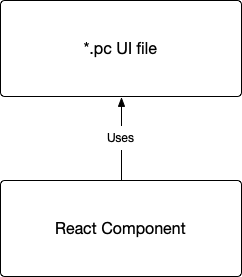

You can think of Paperclip as a tool that focuses _purely_ on your web application's appearance -  just covering HTML, CSS, and basic components. With that, you can construct almost _all_ of your application UI in Paperclip. For example, here's a simple list:

```html live
<style>
  .List {
    padding-left: 1em;
    font-family: sans-serif;
  }
  .ListItem {
    margin-top: 6px;
    &--completed {
      text-decoration: line-through;
    }
  }
</style>

<!-- Components -->

<ol export component as="List" className="List">
  {children}
</ol>

<li export component as="ListItem"
  className="ListItem"
  className:completed="ListItem--completed">
  {children}
</li>

<!-- Preview -->

<List>
  <ListItem>Bagels 🥯</ListItem>
  <ListItem completed>Yakitori 🍢</ListItem>
  <ListItem>Tofurky 🦃</ListItem>
  <ListItem>Skittles 🌈</ListItem>
</List>
```

The `<!-- Preview -->` section isn't actually production code -- it's used primarily for development, and visual regression testing purposes. It's a veeeery important part of Paperclip's design, so you'll be missing out a whole lot if you don't create previews. Take a look at the [guide on writing previews](guide-writing-previews.md) for more information on this. 

Moving on, here's how you can use the template above in a React app:

```jsx
import * as React from "react";
import * as styles from "./GroceryList.pc";

export function GroceryList() {

  const groceries = [
    "Milk 🥛", 
    "Water 💧", 
    "Taco seasoning 🌮"
  ];

  return <styles.List>
    {
      groceries.map(item => (
        <styles.ListItem>{item}</styles.ListItem>
      ))
    }
  </styles.List>;  
}
```

☝🏻 Basically, the only thing that this component is doing is adding dynamic behavior from building blocks defined within the `*.pc` file. And that's all there is to it between Paperclip UIs and code, really. UIs go in Paperclip, logic goes in code. That's it. To put this into more visual terms: 



> Look familar? Definitely not the VC in MVC. Don't you go there! 

This separation between UI and code actually unlocks a lot of really cool features. Namely, by isolating the UI we can optimize for very UI-specific things such as:

- Better tooling around creating UIs: realtime previews, visual editing tools.
- Better safety with free visual regression testing.

☝🏻To name a few. In other words, the "separation of concerns" behind Paperclip is really about _function_ over principle. In all honesty, If I had it my way, I'd keep code & UI together, but it seems like the unverse doesn't gel with that idea based on my experience - things get messy. Separation between UI and logic almost always happens in _some_ form based on my experience, and Paperclip puts that separation to good use.

Now let's get a little use a more sophisticated example to illustrate this separation. Here's a basic UI for an address book app:

```html live
// file: app.pc

<style>
  .App {

  }
</style>

<div export component as="Sidebar" className="Sidebar">
  {children}
</div>

<div export component as="App" className="App">
  {children}
</div>


```


