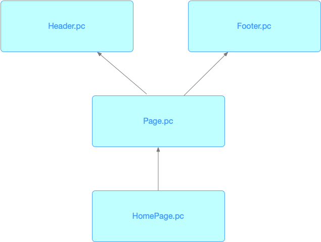

You can think of Paperclip as a tool that focuses _purely_ on your web application's appearance -  just covering HTML, CSS, and basic components. With that, you can construct almost _all_ of your application UI in Paperclip. For example, here's a simple list:

```html live
<style>
  .List {
    padding-left: 1em;
    font-family: sans-serif;
  }
  .ListItem {
    margin-top: 6px;
    &--completed {
      text-decoration: line-through;
    }
  }
</style>

<!-- Components -->

<ol export component as="List" className="List">
  {children}
</ol>

<li export component as="ListItem"
  className="ListItem"
  className:completed="ListItem--completed">
  {children}
</li>

<!-- Preview -->

<List>
  <ListItem>Bagels 🥯</ListItem>
  <ListItem completed>Yakitori 🍢</ListItem>
  <ListItem>Tofurky 🦃</ListItem>
  <ListItem>Skittles 🌈</ListItem>
</List>
```

The `<!-- Preview -->` section isn't actually production code -- it's used primarily for development, and visual regression testing purposes. It's a veeeery important part of Paperclip's design, so you'll be missing out a whole lot if you don't create previews. More on this later on.

Here's how you can use the template above in a React app:

```jsx
import * as React from "react";
import * as styles from "./GroceryList.pc";

export function GroceryList() {

  const groceries = [
    "Milk 🥛", 
    "Water 💧", 
    "Taco seasoning 🌮"
  ];

  return <styles.List>
    {
      groceries.map(item => (
        <styles.ListItem>{item}</styles.ListItem>
      ))
    }
  </styles.List>;  
}
```

☝🏻 Basically, all this component is doing is adding dynamic behavior out of our Paperclip building blocks, and that's all there is to it between Paperclip UIs and code, really. UIs go in Paperclip, logic goes in code. That's it. To put this into more visual terms: 


> Look familar? Definitely not the VC in MVC. Don't you go there! 

This separation between UI and code actually unlocks a lot of really cool features. Namely, by isolating the UI we can optimize for very UI-specific things such as:

- Better tooling around creating UIs: realtime previews, visual editing tools.
- Better safety with free visual regression testing.

☝🏻To name a few. In other words, the "separation of concerns" behind Paperclip is really about _function_ over principle. In all honesty, If I had it my way, I'd keep code & UI together, but it seems like the unverse doesn't gel with that idea based on my experience - things get messy. Separation between UI and logic almost always happens in _some_ form based on my experience, and Paperclip puts that separation to good use.

Let's move onto something a bit more sophisticated 👌. Here's a site:

```html live
// file: HomePage.pc
<import src="./Page.pc" as="Page">

<!-- Previews -->

<Page.Preview>
    Some home content
</Page.Preview>

// file: Page.pc
<import src="./Header.pc" as="Header">
<import src="./Footer.pc" as="Footer">
<import src="./Tokens.pc" as="tokens">

<style>
  .page {
    @include tokens.default-font;
    display: flex;
    flex-direction: column;
    height: 100%;
  }

  .content {
    background: var(--color-background-1);
    height: 100%;
    padding: var(--tb-spacing) var(--lr-spacing);
  }

  h4 {
    @include tokens.default-font;
  }
</style>

<div export component as="Page" className="page" className:dark=">>>tokens.dark">
  {children}
</div>

<div export component as="Content" className="content"> 
  {children}
</div>

<!-- We export the preview here so that _other_ previews can use it -->

<Page export component as="Preview" {dark?}>
  <Header.Preview />
  <Content>{children}</Content>
  <Footer.Preview />
</Page>

<h4>default mode: </h4>
<Preview>
  page content here
</Preview>

<h4>dark mode: </h4>
<Preview dark>
  page content here
</Preview>

// file: Header.pc
<import src="./Tokens.pc" as="tokens">

<style>
  .header {
    @include tokens.default-font;
    box-sizing: border-box;
    background: var(--color-background-2);
    width: 100%;
    padding: var(--tb-spacing) var(--lr-spacing);
    .links {
      display: flex;
      float: right;
      .link {  
        padding: 8px 12px;
        border-radius: 4px;
        text-decoration: none;
        color: var(--color-text-1);
        &--hover {
          background: var(--color-background-3);
        }
      }
    }
    .info {
      display: flex;
      flex-direction: column;
      padding: 30px 0px;
      .headline {
        font-size: 24px;
        margin-bottom: 6px;
      }
      .desc {
        font-size: 0.8em;
      }
    }
  }

</style>

<div export component as="Header" 
  className="header"
  className:dark=">>>tokens.dark">
  {children}
</div>

<div export component as="Links" className="links">
  {children}
</div>

<a export component as="Link" 
  className="link"
  className:hover="link--hover"
  {href?}>
  {children}
</a>

<div export component as="Info" className="info">
  <div className="headline">
    {title}
  </div>
  <div className="desc">
    {description}
  </div>
</div>

<!-- Preview for re-use -->

<Header export component as="Preview" {dark?}>
  <Links>
    <Link href="#">Link 1</Link>
    <Link href="#" hover>Link 2</Link>
    <Link href="#">Link 3</Link>
    <Link href="#">Link 4</Link>
  </Links>
  <Info title="Lorem ipsum" description={<fragment>
    sit amet <strong>sollicitudin</strong> nulla eleifend at.
  </fragment>} />
</Header>

<Preview />
<Preview dark />


// file: Footer.pc
<import src="./Tokens.pc" as="tokens">

<style>
  .content {
    height: 100%;
    padding: var(--tb-spacing) var(--lr-spacing);
  }
  
  .footer {
    @include tokens.default-font;
    background: var(--color-background-2);
    padding: var(--tb-spacing) var(--lr-spacing);
  }
</style>

<div export component as="Footer" className="footer" className:dark=">>>tokens.dark">
  {children}
</div>

<Footer export component as="Preview" {dark?}>
  footer content 
</Footer>

<Preview />
<Preview dark />

// file: Tokens.pc

<style>
  :root {
    --lr-spacing: 40px;
    --tb-spacing: 20px;
    --color-background-1: #FFF;
    --color-background-2: rgba(240, 240, 240, 1);
    --color-background-3: rgba(220, 220, 220, 1);
    --color-text-1: #444;
  }


  @export {
    @mixin default-font {
      font-family: sans-serif;
      color: var(--color-text-1);
    }

    .dark {
      --color-background-1: #222;
      --color-background-2: #333;
      --color-background-3: #555;
      --color-text-1: rgba(255, 255, 255, 0.8);
    }
  }
</style>
```

There are a few things going on here, but I'm just going to focus on the preview components & how this all integrates with code. About preview components, every file has them. This makes it really easy to re-use previews within other UI files to see how the _entire_ UI shapes-up. Keep in mind, these preview components _aren't_ intended to be used in app code - they're purely for development & testing purposes. And if you're using Webpack, Rollup, Parcel, or some other bundler, these previews will be shaken out of the application bundle, so you can add as many of them as you want without increasing your overall application size.

Testing-wise, all we need to do at this point is run the [Percy](docs/configure-percy) CLI tool to run visual regression tests. No other setup needed. 

Now onto how this integrates with code. We'll start off with the `Header` component since it has a few extra moving parts. Here's how it might be used in a React component:

```jsx
import * as ui from "./Header.pc";

export function Header() {
  return <ui.Header>
    <ui.Links>
      <ui.Link>Home</ui.Link>
      <ui.Link href="">About</ui.Link>
      <ui.Link>Contact</ui.Link>
    </ui.Links>
    <ui.Info title="My website" description={<>
      My description
    </>} />
  </ui.Header>
};
```

Next, we'll move onto our `Page` component:

```jsx
import * as ui from "./Page.pc";

// extension added for clarity. Usually it's omitted.
import {Header} from "./Header.tsx"; 

// We're assuming that Footer is already done, too
import {Footer} from "./Footer.tsx"; 

export function Page({ children, dark }) {
  return <ui.Page dark={dark}>
    <Header />
    <ui.Content>{children}</ui.Content>
    <Footer />
  </ui.Page>;
}
```

Can you see the pattern here? The structure of our JSX components are just about the same
as the PC components. If we're looking at the PC graph:




Our JSX graph would look like this:


And this makes since both PC and JSX files both represent the same UI. They're going naturally fall into similar structures.


