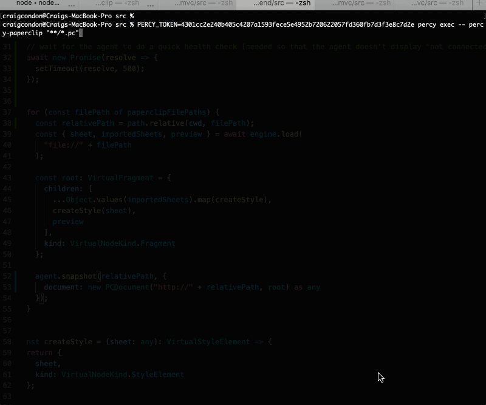

## Installation

Paperclip integrates with [Percy](https://percy.io) to allow you test for CSS bugs in your Paperclip UI files. To get started, install the NPM module:

```
npm install percy percy-paperclip --save-dev
```

Next, grab your percy token, then run the following command in the same directory as your `paperclip.config.json` file:


```bash
PERCY_TOKEN=[TOKEN] percy exec -- percy-paperclip
```

After that, you should see something like this:




## Setting up with GitHub actions

TODO