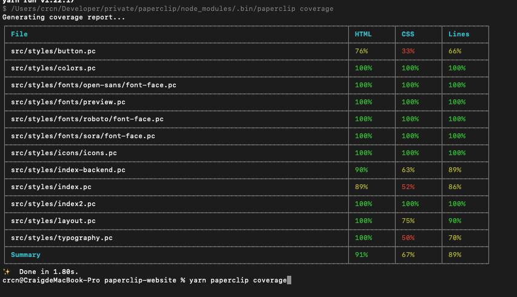
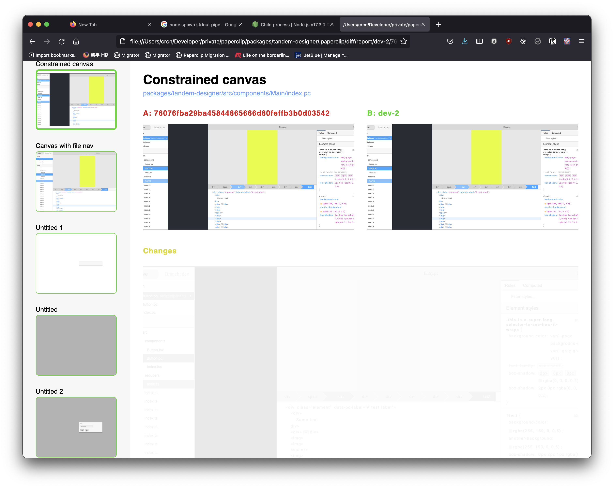

The CLI tool is used primarily to compile Paperclip files into your target framework. 

## Installation

`yarn add paperlip-cli --dev`

## Commands

### `paperclip init`

Configures Paperclip with your current project & installs compilers.

### `paperclip build`

Generates code based on your [paperclip config](configure-paperclip.md). 

**Options**

- `write` - Option to write compiled UI files to disk. Output is otherwise printed in the console log. Currently, files are written to the same directory as the `*.pc` files, so be sure to add `*.pc.*` to your `.gitignore`.
- `watch` - Starts the file watcher & rebuilds UIs whenever they change.
- `definition` - Generate a typed definition file (Specific to TypeScript)

```sh

# Build all Paperclip files and print to stdout
paperclip build --print

# Build Paperclip files & writes them
paperclip build

# Starts watcher & writes them whenever they change
paperclip build --watch
```

### `paperclip dev`

Start the [visual tooling](visual-tooling.md). 

## `paperclip coverage`

Generage a coverage report about HTML & CSS that is covered for **visual regressions**.



**Options**

- `--html` - generate HTML report
- `--open` - open the HTML report after generating
- `--output` - directory where to generate coverage report. Default is `.paperclip/cov`

```sh

# Generate coverage report and open
paperclip coverage --html --open

# Generate coverage report and output to ./civ
paperclip coverage --html --output=cov
```

## paperclip snapshot

Generates a base snapshot of the current branch for visual regression testing. Snapshots are saved to `.paperclip/`

**Options**

- `--force` - force snapshot if there are unstaged changes.

## paperclip diff [branch]

Generates a report of visual changes against a different version of your
application.



**Options**

- `--open` - open HTML report when emitted.
- `--html` - emit HTML report
- `--watch` - run differ in watch mode, re-run when files change.

```sh

# diff against master, generate HTML report, and re-run when the current branch changes
paperclip diff master --html --watch --open

# diff changes against snapshot of this brnach
paperclip diff --html --watch --open
```

