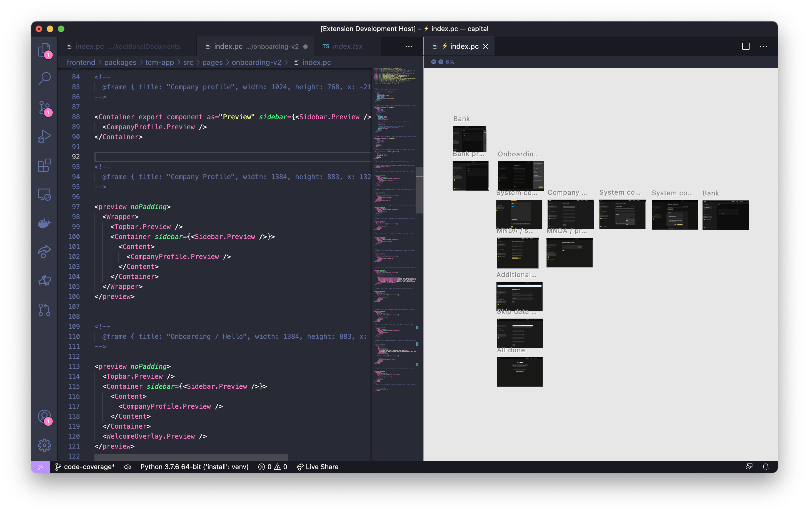

### Basics

You can use regular HTML & CSS in Paperclip. For example:


```html live height=260px
<style>
  div {
    color: purple;
    font-size: 32px;
    font-family: papyrus;
  }
</style>
<div>I'm purple!!</div>
```

The big difference between Paperclip and regular HTML & CSS is that CSS in Paperclip is scoped. This means that styles won't leak into other documents. 

You _can_ define global CSS, but you need to be explicit about that using the [`:global()`](#global) selector. You can also override styles into other documents using [selector reference syntax](#class-reference). You can also use styles defined within another document by using the [@export](#@export) or [inject-styles](#inject-styles).

## Styling


### Nested rules

Nested rules eliminates some redundancy around defining style selectors.

**Syntax**:

```css
.parent-rule {

  /* equivalent to: .parent-rule .child-rule */
  .child-rule {

  }
  /* equivalent to: .parent-rule--variant */
  &--variant-rule {

  }
}
```

**Example**:


```html live height=500px
// file: nested-style-demo.pc
<style>
  .container {
    .header {
      font-size: 32px;
      font-weight: 600;
      color: red;
    }
    .content {
      font-size: 18px;
      color: blue;
    }
  }
</style>

<div class="container">
  <div class="header">
    Header
  </div>
  <div class="content">
    content
  </div>
</div>
```

The `&` token can be used to combine the _parent_ selector in nested rules like so:

```html live height=550px
// file: nested-combine-demo.pc
<style>
  .button {
    font-family: Noteworthy;
    background: grey;
    display: inline-block;
    border: 2px solid grey;
    border-radius: 2px;
    padding: 2px 10px;
    &--secondary {
      color: grey;
      background: transparent;
    }
    &.preview {
      margin: 10px;
    }
  }
</style>

<div class="button preview">
  Button primary
</div>
<div class="button button--secondary preview">
  Button secondary
</div>
```

Also note that you can nest `@media` queries like so:

```css
div {
  @media screen and (max-width: 400px) {
    color: blue;
  }
}
```

### Element scoping

Style blocks that are the defined within elements are _scoped_ to that element. For example:

```html live height=320px
<div>
  <div>
    <style>
      color: red;
      span {
        color: blue;
      }
    </style>
    I'm red text!  
    <span>I'm blue text!</span>
  </div>
  I'm black text
</div>
```

Declarations defined directly in the style elements like the example above are applied to the parent element.

Scoped styles are recommended since they keep your styles & elements together in one spot, which makes them a bit more maintainable. It also provides you an easier way to know exactly what's being styled at a glance.


### :within(ancestor-selector)

`:within([ancestor-selector])` allows you to apply styles within a parent or ancestor.

```html live height=330px
<div class="bolder">
  <div>
    <style>

      /* this style block is applied if a 
      parent / ancestor has .bolder class */
      &:within(.bolder) {
        font-weight: 600;
      }
    </style>
    Some text
  </div>
</div>
```


### @mixin

Style mixins are useful for defining a bundle of style declarations (like `color`, `font-size`) that you then can include into style rules.

**Syntax**:

```css
@mixin mixin-name {
  /* style props */
  decl-name: decl-value;

  /* nested rules */
  div {
    color: blue;
  }

  /* takes body of include statement */
  @content;
}
```

**Including mixins syntax**:

```css
.my-style {
  @include mixin-name;

  @include mixin-with-content {
    display: block;
    div {
      color: blue;
    }
  }
}
```

 **Example**:

```html live height=670px
// file: mixin-demo.pc
<style>
  :global(:root) {
    --font-family-default: Quotes Script;
    --color-grey-100: #333;
    --color-green-100: #0C0;
  }
  
  @mixin color-text-green {
    color: var(--color-green-100);
  }
  
  @mixin default-text {
    font-family: var(--font-family-default);
    color: var(--color-grey-100);
    font-size: 32px;
  }
  
  .message {

    /* @include includes style mixins; you can have any number of them separated by spaces. */
    @include default-text;
    @include color-text-green;
    text-decoration: underline;
  }
</style>

<div class="message">
  What has to be broken before you can use it?
</div>
```

### Re-using media queries

Media queries are re-usable in Paperclip by using the following pattern:

```css
@mixin desktop {
  @media screen and (max-width: 1400px) {
    @content;
  }
}

div {w
  @include desktop {
    font-size: 24px;
  }
}
```

### @export

The `@export` rule allows you to export styles to other documents, as well as application code.

**Syntax**:

```css
@export {
  .my-style {
    /* styles here */
  }

  @keyframes my-keyframe {
    /* keyframe code here */
  }

  @mixin my-mixin {
    /* styles here */
  }
}
```

**Example**:

```html live  height=300px
// file: main.pc
<import src="./styles.pc" as="styles" />


<!-- $ is a class reference - docs below -->
<div class="$styles.default-text">
  <style>
    @include styles.big-text;
    animation: styles.pulse 1s infinite;
  </style>

  Hello again!
</div>

// file: styles.pc

<style>

  /* Exported mixins */

  /* @export docs below */
  @export {
    @mixin text-color-green-default {
      color: green;
    }
    @mixin big-text {
      font-size: 32px;
    }
  }

  /* Exported classes */

  @export {
    .default-text {
      font-family: Herculanum;
      letter-spacing: 0.05em;
    }
  }

  /* Exported animations */

  @export {
    @keyframes pulse {
      0% {
        opacity: 1;
      }
      50% {
        opacity: 0.5;
      }
      100% {
        opacity: 1;
      }
    }
  }
</style>
```

Note that you _must_ wrap styles around `@export` if you want to reference them. 

> On that note, I'd recommend only exporting things that you need in other documents since export keywords (`@export`, `export`) make it clear around what's public & private. 

You can reference class names in React code like so:

```jsx
import * as cx from "classnames";
import * as typography from "./typography.pc";
<div className={cx(
  typography.classNames["default-text"]
)}>
```

Note that `.header-text` is not exported, so it's not available in our app code.

### $class-reference

Paperclip allows you to explicitly reference class selectors, which is helpful if you're looking to reference or overrides styles in other documents. 

**Syntax**:

```html
<div class="$class-name" />

<div class="$imported-doc.class-name" />
```

**Example**:

```html live height=180px
// file: main.pc
<import src="./atoms.pc" as="atoms" />

<span class="$atoms.font-default">
  Hello
</span>
// file: atoms.pc

<style>
  @export {
    .font-default {
      font-family: Helvetica;
      color: blue;
      font-size: 32px;
      letter-spacing: 0.05em;
    }
  }
</style>
```

You can also use class references to [override component styles](#overriding-component-styles).

### :global

All style rules are scoped by default to the document they're defined in. This ensures that they don't leak & have unintended side-effects. However, there _are_ rare cases when you may need to define a global style rule, such as styling HTML defined outside of Paperclip that doesn't have a way to define a `class` attribute. 

**Syntax**:

```css
:global(.my-selector-here > div ~ .another-selector) {
  name: value;
}
```

Here's an example that stylizes parts of [react-select](https://github.com/JedWatson/react-select):

```html
<style>

  .wrapper {
    
    /* global for now so that we get tests to pass */
    :global(.select__) {
      &control {
        display: flex;
        background: var(--color-background);

        /* more declarations here */

        &--is-focused {
          /* more declarations here */
        }

        &:hover {
          /* more declarations here */
        }
      }
      &value-container,
      &single-value,
      &multi-value__label,
      &input {
        /* more declarations here */
      }

      /* selectors here */
    }
  }
</style>

<div export component as="Wrapper" class="wrapper">
  {children}
</div>
```


Here's how you use the above styles in React code:

```jsx
import * as ui from './Select.pc';

// Keep the select styles locked in
<ui.Wrapper>
  <DynamicSelect classNamePrefix="select" {...props} />
</ui.Wrapper>

```

Try to avoid `:global` selectors whenever possible since they leak into other documents, and may result in unintended side-effects. If you need to use `:global`, try to wrap it around a style rule that's scoped to the document. For example:

```css
/* Safer to use */
.container {
  :global(body) {

  }
}
```

<!-- TODO: theming guide -->

<!-- TODO BELOW: why you should avoid :global -->

<!-- TODO: guide overriding UIs -->

## Import

You can import [styles](#styling) & [components](#components) from other files. 

**Syntax**:

```html
<import src="./path/to/document.pc" as="unique-namespace" />
```


**Example**:

```html live height=330px
// file: main.pc
<import src="./pane.pc" as="pane" />
<import src="./atoms.pc" as="atoms" />

<pane.Container>
  <pane.Header>
    <span class="$atoms.font-big">
      Header content
    </span>
  </pane.Header>
  <pane.Content>
    Some content
  </pane.Content>
</pane.Container>


// file: pane.pc
<import src="./atoms.pc" as="atoms" />
<style>
  @mixin padded {
    margin: 0px 8px;
  }
</style>

<div export component as="Container" class="Container">
  <style>
    @include atoms.font-default;
  </style>
  {children}
</div>

<div export component as="Header" class="Header">
  <style>
    @include padded;
    font-size: 18px;
    font-weight: 600;
  </style>
  {children}
</div>

<div export component as="Content" class="Content">
  <style>
    @include padded;
  </style>
  {children}
</div>

<!-- Preview -->

Nothing here!

// file: atoms.pc

<style>
  @export {
    @mixin font-default {
      font-family: Helvetica;
    }
    .font-big {
      @include font-default;
      font-size: 24px;
    }
  }
</style>
```

The import `as` keyword defines a namespace that you can use to access exported properties defined within other documents, like above.

**Other examples**:

- [Exporting styles](#export)
- [Exporting components](#exporting-components)

#### inject-styles

The `inject-styles` props injects all of the import's exported styles into the current document. For example:

```html
<import src="./tailwind.css" inject-styles />

<div class="font-sans">
  Styles from tailwind.css
</div>
```

This is particularly useful for third-party CSS since `inject-styles` includes _all_ CSS selectors (class, ID, element, etc) into the current scope. Note that injected styles are only applied to the current document, so if you're importing components from another file, those components won't be styled. For example:


```html
<import src="./tailwind.css" inject-styles />
<import src="./some-module.pc" as="module" />

<div class="font-sans">
  Styles from tailwind.css

  <!-- injected styles are NOT applied to this element -->
  <module.Test />
</div>
```

Note that `.css` files are a special case since all selectors are automatically exported. If you want to inject styles from a `.pc` file, you'll need to explicitly export the styles that you'd like to inject. For example:

```html
<style> 
  @export {
    * {
      box-sizing: border-box;
    }

    .font-large {
      font-size: 24px;
    }
  }

  .this-class-is-not-applied {
    color: orange;
  }
</style>
```

👆 everything that is defined within `export` can be injected into a document. Here's how you use the above example:

```html
<import src="./my-module.pc" inject-styles />
<div class="font-large">
  I'm large text
</div>
```
## Components

Components are your UI building blocks. Just add a `component` attribute to a root element (doesn't have a parent).

**Syntax**:

```html

<!-- defining the component -->
<element-name component as="my-component-name">
</element-name>

<!-- using it -->
<my-component-name />
```


**Example**:

```html live height=400px

<!-- class and class can be used interchangeably -->
<!--
  @frame { visible: false }
-->
<div component as="Message" class="Message">
  <style>
    font-family: Comic Sans MS;
    font-size: 32px;
    color: #F0F;
  </style>
  {children}
</div>

<!-- Preview section -->

<Message>
  Hooray!
</Message>
```

### Exporting components

Components can be exported to be used in application code, as well as other documents.

**Syntax**:

```html

<!-- just add the "export" attribute to any component -->
<div export component as="MyComponent">
</div>
```

**Example**:

```html live height=1000px
// file: todos.pc
<import src="./styles.pc" as="styles" />

<!-- Components -->

<!--
  @frame { visible: false }
-->
<div export component as="App" class="$styles.App">
  {children}
</div>

<!--
  @frame { visible: false }
-->
<input export component as="NewItemInput" {onChange} />

<!--
  @frame { visible: false }
-->
<div export component as="Header" class="$styles.Header">
  <h4>Todos</h4>
  {children}
</div>

<!--
  @frame { visible: false }
-->
<ul export component as="List" class="$styles.List">
  {children}
</ul>

<!--
  @frame { visible: false }
-->
<li export component as="Item" class="$styles.Item" {onClick}>
  <input type="checkbox" checked={completed} /> 
  <span class="$styles.label">{children}</span>
</li>

<!-- Preview -->

<App>
  <Header>
    <NewItemInput />
  </Header>
  <List>
    <Item>Wash car</Item>
    <Item>Wash car</Item>
    <Item completed>Wash car</Item>
  </List>
</App>

// file: styles.pc

<!-- Typically in the same file as components, but they're here for this demo since they're not the focus. -->
<style>
  @export {
    .App {
      font-family: Chalkduster;
    }
    .Header {  
      h4 {
        margin: 0;
        margin-bottom: 8px;
      }
      margin-bottom: 8px;
    }
    .List {
      margin: 0;
      padding: 0;
      list-style-type: none;
    }
    .Item {

      // Needs
      :global(input[type="checkbox"]) {
        margin-right: 8px;
        &:checked ~ .label {
          text-decoration: line-through;
        }
      }
    }
  }
</style>
```

Here's how we can use this in our React app:

```jsx
import React, { useRef, useState } from "react";
import * as ui from "./todos.pc"

const TodoApp = () => {
  const [todos, setTodos] = useState([
    { completed: true, label: "walk dog" },
    { completed: true, label: "take out trash" }
  ]);

  const onNewInputChange = (event) => {
    // code to add new todo item here
  }

  return <ui.App>
    <ui.Header>
      <NewItemInput onChange={} />
      <ui.List>
        {todos.map(({completed, label}, i) => (
          <ui.Item 
            onClick={/* toggle completed handler here */} 
            completed={completed}>
            {label}
          <ui.Item>
        ))}
      </ui.List>
    </ui.Header>
  </ui.App>;
}
```

We can also use our exported component in other Paperclip documents. Here's an example:


```html live height=370px
// file: importing-components-demo.pc
<import src="./todos.pc" as="todos" />

<style>
  .preview {
    display: flex;
    &-item {
      margin-left: 20px;
    }
  }
</style>

<div class="preview">
  <todos.Preview class="$preview-item" />
  <todos.EmptyPreview class="$preview-item" />
</div>

// file: todos.pc
<import src="./styles.pc" as="styles" />

<!-- Components -->

<!--
  @frame { visible: false }
-->
<div export component as="App" class="$styles.App {class?}">
  {children}
</div>

<!--
  @frame { visible: false }
-->
<input export component as="NewItemInput" {onChange} />

<!--
  @frame { visible: false }
-->
<div export component as="Header" class="$styles.Header">
  <h4>Todos</h4>
  {children}
</div>

<!--
  @frame { visible: false }
-->
<ul export component as="List" class="$styles.List">
  {children}
</ul>

<!--
  @frame { visible: false }
-->
<li export component as="Item" class="$styles.Item" {onClick}>
  <input type="checkbox" checked={completed} /> 
  <span class="$styles.label">{children}</span>
</li>

<!-- Export re-usable previews that can be used
in other previews -->

<!--
  @frame { visible: false }
-->
<App export component as="Preview" {class?}>
  <Header>
    <NewItemInput />
  </Header>
  <List>
    <Item>Clean cat car</Item>
    <Item>Wash car</Item>
    <Item completed>Wash car</Item>
  </List>
</App>


<!--
  @frame { visible: false }
-->
<App export component as="EmptyPreview" {class?}>
  <Header>
    <NewItemInput />
  </Header>
  Nothing to see here
</App>

<!-- render main preview -->
<Preview />

// file: styles.pc

<!-- Typically in the same file as components, but they're here for this demo since they're not the focus. -->
<style>
  @export {
    .App {
      font-family: Chalkduster;
    }
    .Header {  
      h4 {
        margin: 0;
        margin-bottom: 8px;
      }
      margin-bottom: 8px;
    }
    .List {
      margin: 0;
      padding: 0;
      list-style-type: none;
    }
    .Item {

      // Needs
      :global(input[type="checkbox"]) {
        margin-right: 8px;
        &:checked ~ .label {
          text-decoration: line-through;
        }
      }
    }
  }
</style>
```

### Overriding component styles

You can override styles in other components assuming that a component exposes an attribute that's bound to `class`. 

**Syntax**:

```html
attributeBoundToClassName="$class-name"
```

**Example**:

```html live height=270px
// file: style-override-demo.pc
<import as="Message" src="./message.pc" />
<style>
  .my-style-override {
    text-decoration: underline;
  }
</style>
<Message class="$my-style-override">
  Hello World
</Message>

// file: message.pc

<!--
  @frame { visible: false }
-->
<div export component as="default" class="{class?}">
  <style>
      font-size: 24px;
      font-family: Helvetica;
  </style>
  {children}
</div>
```

Check out [class references](#class-reference) for more information on how to use `$`.

#### Using scoped styles

Alternatively, you can overriding your components appearance by using scoped styles like so:

```html live height=400px

<!-- Note that class is still necessary here! -->
<!--
  @frame { visible: false }
-->
<div export component as="Message" {class?}>
  <style>
    font-family: sans-serif;
    color: red;
  </style>
  {children}
</div>

<Message>
  <style>
    color: blue;
  </style>

  I'm blue text!
</Message>
```

Note that you need to provide a `class` in your component for inline style overrides to work.

☝🏻 this approach keeps your overrides together, which can be a bit easier to read. The other benefit to this approach is that your code remains portable since everything's in one spot. 

### Changing the tag name

You may want to change the native tag name of a component. An example of this is a `Button` component that may be a `button` or `a` tag. 

**Syntax**

```html
<button export component as="Button" {tagName?}>
  {children}
</button>
```

**Example**

```html live height=270px
// file: demo.pc 

<!--
  @frame { visible: false }
-->
<input component as="Input" {tagName?} {placeholder} />

<div>
  <Input placeholder="I'm a text input" />
  <Input tagName="textarea" placeholder="I'm a text area" />
</div>

```

## Bindings

Bindings allow you to define dynamic behavior in components.

### Child bindings

**Syntax**:

```html
<div component as="MyComponent">

  <!-- reserved keyword - takes element children. -->
  {children}
  
  <!-- can be defined via attributes -->
  {anotherSlot}
</div>
```

**Example**:

```html live height=280px

<!--
  @frame { visible: false }
-->
<h1 component as="Header">
  {children}
</h1>

<Header>
  I'm a header
</Header>
```

There will probably be the case where you want to define multiple areas of a component for children to go into. Here's an example of that:

```html live height=500px
// file: main.pc
<import src="./styles.pc" as="styles" />

<!--
  @frame { visible: false }
-->
<div component as="Pane" class="$styles.Pane">
  <div class="$styles.header">
    <div class="$styles.title">{title}</div>
    <div>{controls}</div>
  </div>
  <div class="$styles.content">
    {children}
  </div>
</div>

<div component as="AddButton">
  +
</div>

<Pane title={<strong>My header</strong>} controls={<AddButton />}>
  Lorem ipsum dolor sit amet, consectetur adipiscing elit.
</Pane>

// file: styles.pc

<!-- keeping this in another file so that it's not the center of attention -->
<style>
  @export {
    .Pane {
      font-family: Courier;
      width: 200px;
      color: #333;
      .header, .content {
        padding: 4px 8px;
      }
      .header {
        background: #C0C0C0;
        display: flex;
        .title {
          flex-grow: 1;
        }
      }
      .content {
        background: #CFCFCFCF;
        padding: 4px;
      }
    }
  }
</style>
```

`{title}` and `{controls}` (and technically also `{children}`) are considered _slots_ for child nodes to go into, and they can be filled in via attributes:

```html
<Pane 
  title={<span>some title</span>} 
  controls={<button>A button</button>}>
  Content children
</Pane>
```

### Attribute bindings

You can define dynamic attributes on your elements. For example:

```html live height=450px
// file: buttons.pc
<import src="./typography.pc" as="typography" />
<import src="./styles.pc" as="styles" />

<!-- Components -->

<!-- Generally I'd recommend just a `{class}` binding instead of `{customClassName}` class name, which I'm only using here to make more clear around how it works. -->
<!--
  @frame { visible: false }
-->
<div component as="Button" 
  class="$styles.button {customClassName}">
  {children}
</div>


<Button customClassName="$typography.big-text $typography.strong">
  Button
</Button>

// file: styles.pc
<import src="./typography.pc" as="typography" />
<style>
  @export {
    .button {
      color: red;
      @include typography.default-text;
    }
  }
</style>

// file: typography.pc
<style>
  @export {
    @mixin default-font {
      font-family: Helvetica;
    }
    @mixin default-text {
      @include default-font;
      font-size: 18px;
      color: #333;
    }
    .big-text {
      @include default-font;
      font-size: 32px;
      font-weight: 
    }
    .strong {
      font-weight: 800;
    }
  }
</style>
```

Bindings can also be defined outside of string attributes. For example:

```html
<div component as="Test">
  <span class="title" ref={spanRef}>
    {title}
  </span>
  {children}
</div>
```

> Ref here is specific to React around referencing DOM nodes. 

You can also use the shorthand approach like so:

```html
<div component as="Test" {ref}>
  <span class="title">
    {title}
  </span>
  {children}
</div>
```

This is particularly useful for making your code more DRY. For example:

```html
<input export component as="Input" 
  {onChange?} 
  {defaultValue}
  {value}
/>
```


### Optional bindings

By default, bindings are required. So if you define `{class}` on an element, that property will be required when compiled into application code. To make a binding optional, just add a `?` after the binding name like so:

```html
<div component as="Message" {class?}>
  {children}
</div>
```

☝🏻 Here, `class` is optional, whereas `children` is not. When compiled to TypeScript, here's what you get:

```typescript
/* other generated code here */

type MessageProps = {
  class?: Function,
  children: ReactNode,
};

export const Message: React.FC<MessageProps>;
```

<!-- > For more information around type safety, take a look at the [type safety doc](safety-definition-files.md). -->

<!-- TODO: docs on type safety -->

### Variant styles

The variant style syntax allows you to conditionally apply styles. For example:

**Syntax**:

```html
<div component as="MyComponent" class:variant-name="class-name">
</div>

<!-- defining variant-name will apply class-name style -->
<MyComponent variant-name />
```

**Example**:

```html live height=900px

<!--
  @frame { visible: false }
-->
<div component as="Header"
  class:big="big"
  class:medium="medium"
  class:small="small">

  <style>
    font-family: Luminari;
    font-size: 12px;

    /* I recommend that you do this instead of &.big to avoid
    CSS specificity issues */
    &.big {
      font-size: 32px;
    }
    &.medium {
      font-size: 18px;
    }
    &.small {
      font-size: 12px;
    }

  </style>

  {children}
</div>

<div>
  <Header big>
    Big header
  </Header>
  <Header medium>
    Medium header
  </Header>
  <Header small>
    Small header
  </Header>
  <Header>
    Regular header
  </Header>
</div>
```


## Fragments

Fragments are useful if you want to render a collection of elements. For example:

```html live height=350px
<!--
  @frame { visible: false }
-->
<ul component as="List">
  {listItems}
</ul>

<List
  listItems={<fragment>
    <li>feed fish</li>
    <li>feed cat</li>
    <li>feed me</li>
  </fragment>}
/>
```

You can also define components from them:

```html
<fragment component as="Items">
  <li>Item</li>
  <li>Item 2</li>
  <li>Item 3</li>
  <li>Item 4</li>
</fragment>

<ul>
  <Items />
</ul>
```

## Annotations

Annotations allow you to specify additional metadata about your elements -- this is used particularly
for documentation & other visual helpers when developing your UIs.

### @frame

The `@frame` annotation allows to you to specify preview frame dimensions for your element. For example:

<!--  -->

`x/y/width/height` dimensions can be specified visually in the preview window. 

To hide frames from rendering, you can specify `visible: false` like so:

```html
<!-- 
  @frame { visible: false }
-->
This frame isn't visible in the preview
```
