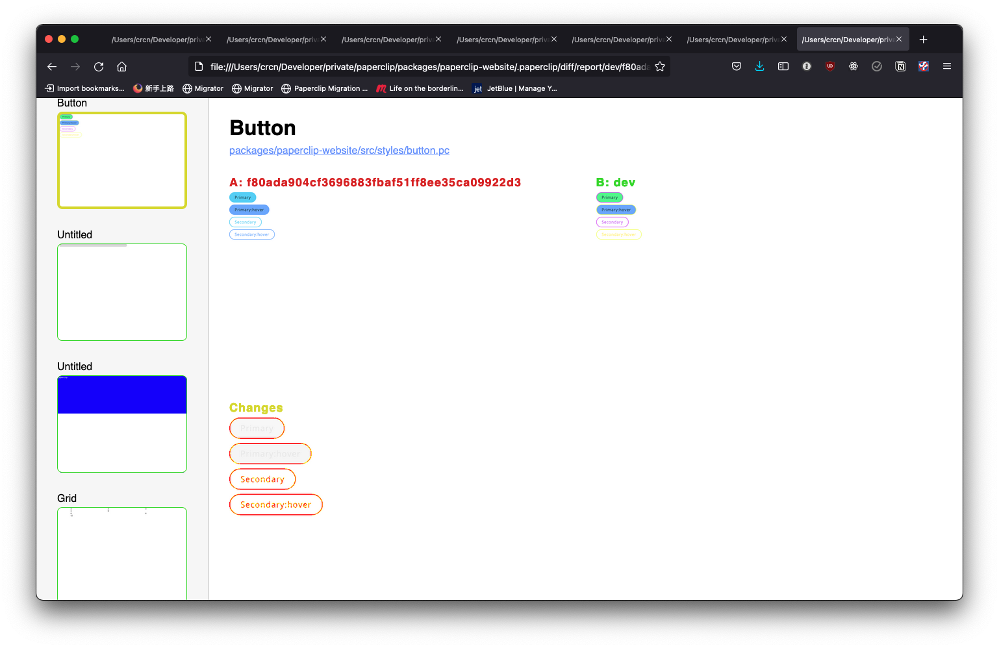

Paperclip comes with a number of tools to help you keep track of visual changes. The [code coverage](#html-and-css-coverage) tool helps you figure out how much code is covered for visual changes, and the 
[snapshot](#snapshot-tests) tool helps you analyze changes across your app. 

### HTMl and CSS coverage

The code coverage tool helps you analyze how much HTML and CSS is visible for snapshot testing. All you need to do is run the following command
in your project:

```
yarn paperclip coverage --html --open
```

This will generate an HTML report and open it up in your browser. The report will look something like this:


You can navigate this report to find code that's dead or isn't covered for visual changes. Here's what a file looks like:


The green section indicates code that's covered for snapshot testing, the red section indicates code that's either dead or needs to be set up for snapshot testing.

To set up UIs for snapshot tests, all you need to do is apply the CSS to any visible element in a `*.pc` file. In the case of our button above, we can just create a new [preview](guide-previews) directly in the button file.


The preview code for this is simply:

```html
<!--
  @frame { width: 330, height: 169, x: 0, y: 0 }
-->
<div class="text-default">  
  <style>
    display: flex;
    flex-direction: column;
    align-items: flex-start;
    grid-row-gap: 8px;
  </style>

  <!-- previews for visual regression testing -->
  <Anchor>Primary</Anchor>
  <Anchor hover>Primary:hover</Anchor>
  <Anchor secondary>Secondary</Anchor>
  <Anchor secondary hover>Secondary:hover</Anchor>
</div>
```

This satisfies our coverage report. <i>Now</i> when we run it, this is what's shown:


Now this file is ready for snapshot tests.

### Snapshot testing

Snapshot testing allows you to keep track of visual changes across your `*.pc` files. This is especially useful in tracking changes that may affect many different files.

To use snapshot testing, you'll first need to set up a baseline snapshot, typically on your main or master branch, or whatever branch you currently have in production. Here's how you take a snpshot:

```
git checkout main && && git pull && yarn paperclip snapshot
```

This will store PC file screenshots that we can use as a baseline to check for visual changes. After that, you can run this command on any branch to detect visual changes:

```sh
yarn paperclip diff [baseline-branch] --html --open
```

If our baseline branch is `main`, the command would be:

```sh
yarn paperclip diff main --html --open
```

Here's an example of some changes made to the button file:


This is what the diff report looks like for the button file:



You'll notice in the left sidebar that all UIs that are affected by this change are towards the top, and outlined in yellow. Here's another UI that was captured by this change:


