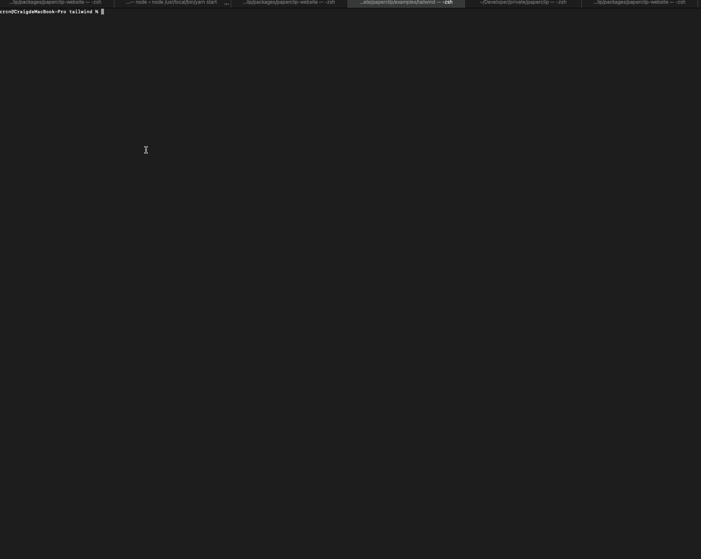

Paperclip comes with visual tooling that enables you to build your UIs in realtime. The quickest way to start using the visual tools is to run:

```
npx @paperclipui/cli designer
```

In your project directory where your Paperclip files live. Here's what you should see:



You can run this window in tandem with your text editor, and changes that you make will instantly appear when you save.

### Tips

- To **zoom**, scroll & hold down the `meta` / `ctrl` key.
- To **measure between elements**, just select an element, then hold `meta` / `ctrl` by hovering over another element.

