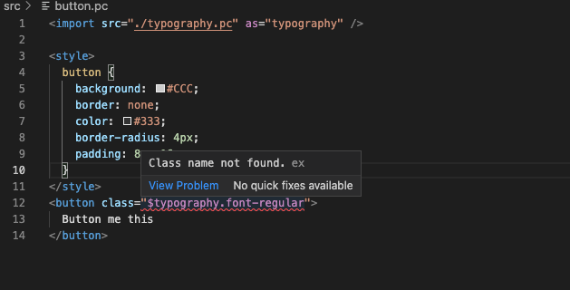

One of the things that I find problematic about CSS is that it’s global. CSS in a small project is manageable, but it increasingly becomes difficult to scale as applications get larger. <!--truncate-->For example, this code *alone* isn’t too problematic: 

```html
<link rel="stylesheet" href="./card.css">

<div class="card">
</div>
```

I think the simplicity of this is nice, and probably works fine with a small app. However, it’s *a* bit fragile when it comes to larger applications, especially when working with other people. If someone accidentally adds a new `.card` class somewhere else in the codebase, my card element above will break. Patterns like BEM or SMACSS help alleviate this problem by providing rules around how to write CSS, but those rules don’t address a deeper problem that appears to be at the language level. This is one of Paperclip’s core focuses.

Paperclip is a UI layer for web applications that aims to help developers write HTML & CSS that scales well by making CSS predictable and providing tools for keeping track of visual changes across Paperclip files. It’s in a similar spirit as TypeScript’s added safety to JavaScript. Paperclip aims to provide an extra layer of safety around HTML & CSS. Here’s a simple example:

```html
<!-- src/hello.pc -->

<style>
  div {
    color: red;
  }
</style>

<div>
  Hello World
</div>
```

Styles in Paperclip are scoped by default. In other words, the styles here are only applied to the elements in this document. To illustrate how this works, here’s what a *compiled* Paperclip file might look like in regular HTML & CSS:

```html
<style>
  div._59bb {
    color: red;
  }
</style>

<div class="_59bb">
  Hello world
</div>
```

> Example of generated code from a `*.pc` file.
> 

With Paperclip, you know exactly what’s going on.  You don’t have to worry about styles leaking into other documents, so you’re free to write HTML & CSS however you want. Of course, you may want to expose styles to other files. Here’s an example of how to do that:

```html
<!-- src/typography.pc -->
<style>
  @mixin font-base {
    font-family: sans-serif;
  }
   
  /* Make these styles accessible to other documents */
  @export {
    .font-regular {
      @include font-base;
      font-size: 14px;
    }

    .font-heading {
      @include font-base;
      font-weight: 600;
      font-size: 18px;
      letter-spacing: 0.06em;
    }
  }
</style>
```

The `@export` block is an explicit way to expose styles into other documents. Everything within an export block is considered *public,* and usable in other documents. Everything outside of an export block is considered *private* and only works within the document. Here’s how you use exposed styles in another file:

```html
<!-- src/button.pc -->
<import src="./typography.pc" as="typography" />

<style>
  button {
    background: #CCC;
    border: none;
    color: #333;
    border-radius: 4px;
    padding: 8px 16px;
  }
</style>

<button class="$typography.font-regular">
  Button me this
</button>
```

Styles from other documents must be explicitly referenced, which is what you’ll notice above with the `$typography.font-regular` reference. This is helpful since it enables the `typography.pc` file to remain easily refactorable later on. For example, if you remove the `font-regular` style (Or move it outside of the `@export` block), the Paperclip compiler will complain about the `font-regular` reference being used in the `button.pc` file:



Along with any other file where `$typography.font-regular` is used. This makes refactoring relatively straightforward since all you need to do is fix whatever Paperclip is complaining about - this should feel similar to TypeScript. When it comes to *global* styles, those need to be made explicit using special syntax. Here’s an example:

```html
<style>
  :global(.some-selector) {
    color: red;
  }
</style>
```

The global syntax exists mainly to give you an escape hatch for Paperclip when you need to handle edge cases, like integrating with third-party HTML that might not have hooks that Paperclip can tap into. For the most part, Paperclip provides enough functionality so that you’ll rarely need to use `:global`.  And when you do need global CSS, you’ll know where it is. 

Paperclip is generic, and designed for any kind of web application. Taking our example button above, here’s how we might expose it to application code: 

```html
<!-- src/Button.pc -->
<import src="./typography.pc" as="typography" />

<style>
  button {
    background: #CCC;
    border: none;
    color: #333;
    border-radius: 4px;
    padding: 8px 16px;
  }
</style>

<button export component as="Button" class="$typography.font-regular">
  {children}
</button>
```

Paperclip exposes just enough information that allows you to hook UI files into your codebase. This makes it possible for Paperclip to be used in just about any language. For example, you could import this UI file into React like so:

```typescript
// src/entry.tsx
import React from "react";
import ReactDOM from "react-dom";
import * as styles from "./Button.pc";

ReactDOM.render(<styles.Button>
    Click me!
  </style.Button>, 
  document.body.getElementById("app")
);
```

If you’re familiar with [Styled Components](https://styled-components.com/), the API is similar. If you want, you can also access class names directly. Using our `typography.pc` example above, here’s how we might access the `font-regular` class in TypeScript:

```jsx
//src.entry.tsx
import React from "react";
import ReactDOM from "react-dom";
import * as styles from "./typography.pc";

ReactDOM.render(<div className={styles.classNames["font-regular"]}>
    Hello world!
  </div>, 
  document.body.getElementById("app")
);
```

Paperclip files compile to strongly typed code, so if `font-regular` is removed from the `typography.pc` file, then TypeScript will complain about that. 

Suppose you want to use Paperclip with PHP, the usage for that might look something like this:

```php
<?php
  require "./button.pc.php";  
  echo styles\App(
    styles\SignupForm(
      array("action" => "/signup", "title" => "Log In"),
      styles\TextInput(array("name" => "email")),
      styles\TextInput(array("name" => "password")),
      styles\Button("sign up")
    )
  );
?>
```

The PHP compiler is currently in development, but this gives you a sense of how Paperclip is aiming to be a general solution. Eventually, the goal is for all web applications to benefit from scoped HTML & CSS.

Scoped CSS is just one area that Paperclip is covering to help with scalable HTML & CSS. There's also visual regression coverage, accessibility, responsive development, and other aspects that contribute to solid UI code. Next time I'll talk about how Paperclip helps with all of that.

Also, If you'd like to help contribute to Paperclip in any capacity, feel free to reach out!
